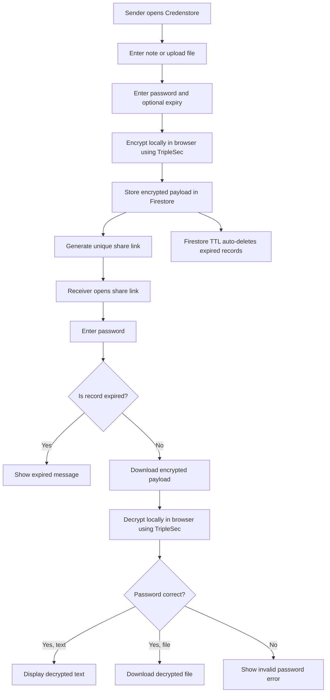

# Credenstore - Zero-Knowledge Encrypted Storage
Note: This project is live at https://credenstore.web.app




This project is built using Vue, Vuetify (Material Design framework for Vue) and Vue-router to create the application UI and some routing logic.

This project also uses Triplesec for encrypting and decrypting the content and uses Cloud Firestore to store the encrypted content on cloud. There is a direct connection between UI and Cloud Firestore and no middleware servers are involved to store or manipulate any kind of data. All the encryption and decryption happens on client's end and it is the responsibility of client to remember the retrieval link and decryption password. This project also uses file saver for downloading the content in form of file.

## Project setup
```
npm install
```

### Compiles and hot-reloads for development
```
npm run serve
```

### Compiles and hot-reloads for development and open on browser
```
npm run start
```

### Compiles and minifies for production
```
npm run build
```
